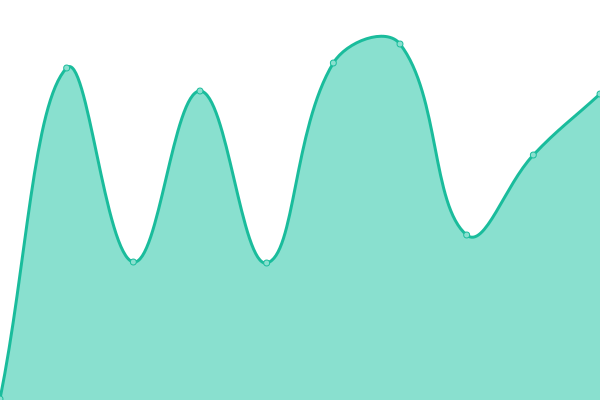
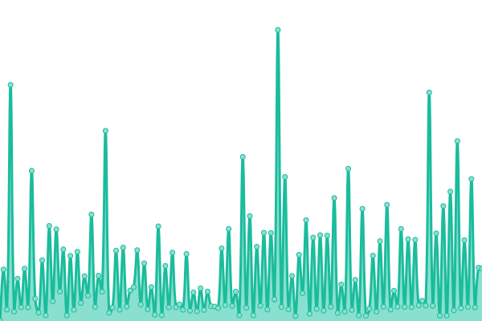
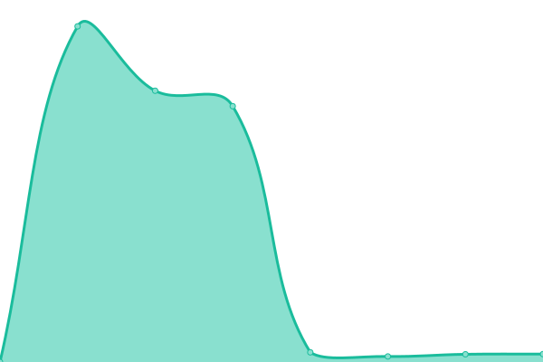

# [📈 Live Status](https://LaunchQ.github.io/LaunchQStatus-DEV): <!--live status--> **🟩 All systems operational**

This repository contains the open-source uptime monitor and status page for [LaunchQ](https://LaunchQ.github.io/LaunchQStatus-DEV), powered by [Upptime](https://github.com/upptime/upptime).

With [Upptime](https://upptime.js.org), you can get your own unlimited and free uptime monitor and status page, powered entirely by a GitHub repository. We use [Issues](https://github.com/LaunchQ/LaunchQStatus-DEV/issues) as incident reports, [Actions](https://github.com/LaunchQ/LaunchQStatus-DEV/actions) as uptime monitors, and [Pages](https://LaunchQ.github.io/LaunchQStatus-DEV) for the status page.

<!--start: status pages-->
<!-- This summary is generated by Upptime (https://github.com/upptime/upptime) -->
<!-- Do not edit this manually, your changes will be overwritten -->
<!-- prettier-ignore -->
| URL | Status | History | Response Time | Uptime |
| --- | ------ | ------- | ------------- | ------ |
|  [LaunchQ Web App](https://app-dev.launchq.ai/) | 🟩 Up | [launch-q-web-app.yml](https://github.com/LaunchQ/LaunchQStatus-DEV/commits/HEAD/history/launch-q-web-app.yml) | 

 527ms
     
 | 

<a href="https://LaunchQ.github.io/LaunchQStatus-DEV/history/launch-q-web-app">100.00%</a>
    

|  LaunchQ API | 🟩 Up | [launch-q-api.yml](https://github.com/LaunchQ/LaunchQStatus-DEV/commits/HEAD/history/launch-q-api.yml) | 

 2505ms
     
 | 

<a href="https://LaunchQ.github.io/LaunchQStatus-DEV/history/launch-q-api">100.00%</a>
    

|  LaunchQ SFDC API | 🟩 Up | [launch-q-sfdc-api.yml](https://github.com/LaunchQ/LaunchQStatus-DEV/commits/HEAD/history/launch-q-sfdc-api.yml) | 

 1972ms
     
 | 

<a href="https://LaunchQ.github.io/LaunchQStatus-DEV/history/launch-q-sfdc-api">96.30%</a>
    

|  LaunchQ Twilio API | 🟩 Up | [launch-q-twilio-api.yml](https://github.com/LaunchQ/LaunchQStatus-DEV/commits/HEAD/history/launch-q-twilio-api.yml) | 

 6433ms
     
 | 

<a href="https://LaunchQ.github.io/LaunchQStatus-DEV/history/launch-q-twilio-api">100.00%</a>
    

|  LaunchQ Twilio API 2 | 🟩 Up | [launch-q-twilio-api-2.yml](https://github.com/LaunchQ/LaunchQStatus-DEV/commits/HEAD/history/launch-q-twilio-api-2.yml) | 

 678ms
     
 | 

<a href="https://LaunchQ.github.io/LaunchQStatus-DEV/history/launch-q-twilio-api-2">63.67%</a>
    

|  LaunchQ User API | 🟩 Up | [launch-q-user-api.yml](https://github.com/LaunchQ/LaunchQStatus-DEV/commits/HEAD/history/launch-q-user-api.yml) | 

 6614ms
     
 | 

<a href="https://LaunchQ.github.io/LaunchQStatus-DEV/history/launch-q-user-api">100.00%</a>
    

<!--end: status pages-->

[**Visit our status website →**](https://LaunchQ.github.io/LaunchQStatus-DEV)

## 📄 License

- Powered by: [Upptime](https://github.com/upptime/upptime)
- Code: [MIT](./LICENSE) © [Anand Chowdhary](https://anandchowdhary.com), supported by [Pabio](https://pabio.com)
- Data in the `./history` directory: [Open Database License](https://opendatacommons.org/licenses/odbl/1-0/)
